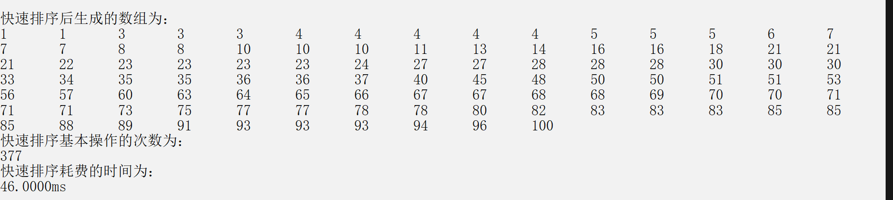
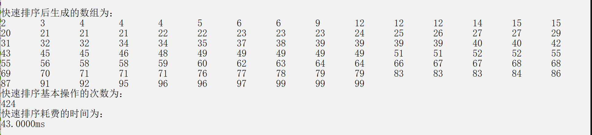
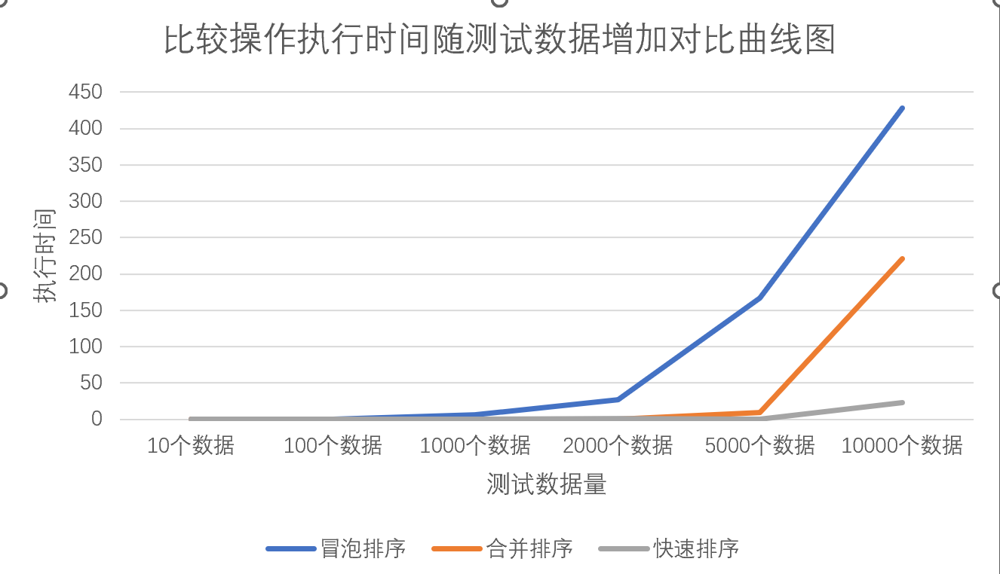

# 分治算法实验报告

## 学号：20201060338

## 实验目的：

- 通过排序算法的程序实现和执行时间测试，与理论上的结论进行对比分析，深入理解算法时间复杂度渐进性态和和增长率的概念；理解分治算法设计的基本思想、递归程序实现的基本方法，加深对分治算法设计与分析思想的理解。

## 实验原理

- 算法时间复杂度分析的相关概念:算法的计算时间取决于算法中某些操作的执行次数，这些操作是算法时间复杂度分析的依据。增长率反映了算法的计算时间复杂度，即随着算法输入规模的增加、算法计算时间增加的趋势。算法的计算时间复杂度针对输入数据的等价类来分析或测试。
- 随机数生成算法 通过程序生成（伪）随机数，作为实验用测试数据。可使用编程语言自带的random 函数生成，也可以采用一些有效的随机数生成算法生成。
- 分治算法:分治算法的基本思想是将一个规模为 n 的问题分解为 k 个规模较小的子问题，这些子问题相互独立且与原问题性质相同。求出子问题的解，就可得到原问题的解。分治算法设计的一般步骤包括：(1) 分解，将要解决的问题划分成若干规模较小的同类问题；(2) 求解，当子问题划分得足够小时，用较简单的方法解决；(3) 合并，按原问题的要求，将子问题的解逐层合并构成原问题的解。
- 测试算法以冒泡排序、合并排序和快速排序算法为例

## 实验输入数据集

- 文本数据集：5,1,2,3,7,14,6
- 随机数数据集：
    srand(time(0));
    for(int i=0; i<n; i++)
      a[i]=1+rand()%n;

## 实验内容

1. 算法实现的c++版本:
       代码网址：https://github.com/naivvve/homework_template/blob/main/work_1/sort_3.cpp

## 实验结果和分析
### 1)使用随机数生成方法生成包含 100 个随机数的测试数据，记录这些数据，并分别记录以上三个排序算法比较操作的执行时间；再重新生成包含 100 个随机数的测试数据，记录这些数据三个排序算法比较操作的执行时间。对比两次生成的测试数据和算法执行中比较操作的次数，理解算法复杂度分析时输入数据等价类的含义。
#### 实验结果分析：
  第一组：
  使用随机数生成方法生成包含 100 个随机数的测试数据如下：
  
  冒泡排序算法的执行时间如下图：
  
  合并排序算法的执行时间如下图：
  
  快速排序算法的执行时间如下图：
  
  第二组：
  使用随机数生成方法生成包含 100 个随机数的测试数据如下：
  
  冒泡排序算法的执行时间如下图：
  
  合并排序算法的执行时间如下图：
  
  快速排序算法的执行时间如下图：
  
- 等价类：
  等价类指某个输入域的集合，在集合中各个输入的条件都是等效的。通常等价类划分为2种情况:有效等价类:对程序规格说明有意义的、合理的输入数据。无效等价类:对程序规格说明无意义的、不合理的输入数据。等价类的划分通常有以下几种（1）规定了输入值的范围或值的个数（2）输入值为布尔值（3）规定了输入数据的一组值。等价类的优点是考虑了单个输入域的各类情况，避免了盲目或随机选取输入数据的不完整性和覆盖的不稳定性。但也存在缺点：方法虽简单易用，但没有对组合情况进行充分的考虑。需要结合其他测试用例设计的方法进行补充。
### 2）使用随机数生成方法生成不同规模的测试数据（10 个，100 个，1000 个，2000 个，5000 个，10000 个，100000 个，……），对于每种规模的测试数据，分别记录 BubbleSort、MergeSort 和 QuickSort 算法执行中比较操作的执行时间，使用 MS Excel、Matlab 或 Origin 等图表绘制工具生成随着输入数据增加、以上三个算法比较操作次数增加的对比曲线图（折线）。基于生成的曲线图，与时间复杂度的理论结论对比分析，理解计算时间渐进性态和增长率的概念。
#### 实验结果分析：
- 10个数据：
  冒泡排序算法的执行时间：0ms ;
  合并排序算法的执行时间：1ms ;
  快速排序算法的执行时间：1ms ;
- 100个数据：
  冒泡排序算法的执行时间：10ms ;
  合并排序算法的执行时间：19ms ;
  快速排序算法的执行时间：20ms ;
- 1000个数据：
  冒泡排序算法的执行时间：208ms ;
  合并排序算法的执行时间：205ms ;
  快速排序算法的执行时间：207ms ;
- 2000个数据：
  冒泡排序算法的执行时间：414ms ;
  合并排序算法的执行时间：396ms ;
  快速排序算法的执行时间：419ms ;
- 5000个数据：
  冒泡排序算法的执行时间：1058ms ;
  合并排序算法的执行时间：1049ms ;
  快速排序算法的执行时间：1061ms ;
- 10000个数据：
  冒泡排序算法的执行时间：2235ms ;
  合并排序算法的执行时间：2086ms ;
  快速排序算法的执行时间：2104ms ;

- 三个算法比较操作次数增加的对比曲线图如下：
  
- 渐进时间复杂度是当问题规模不断增大并趋于无穷大时算法复杂度的数量级，由图可知，在数据规模较大时，冒泡排序的所耗费的时间增长较大。
