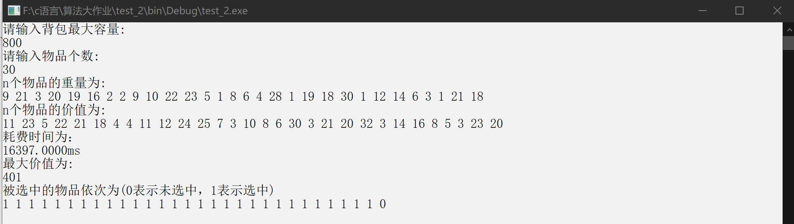
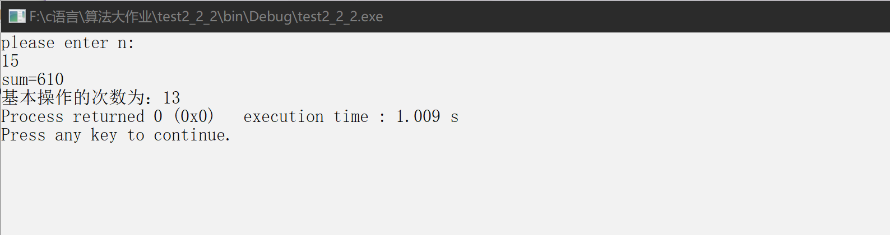

# 动态规划算法实验报告

## 学号：20201060338

## 2.1 动态规划算法的实现与时间复杂度测试

### 实验目的

- 编程实现经典的动态规划算法，理解动态规划算法设计的基本思想、程序实现的相关技巧，加深对动态规划算法设计与分析思想的理解。通过程序的执行时间测试结果，与理论上的时间复杂度结论进行对比、分析和验证。

### 实验原理

- 动态规划算法的基本思想动：态规划是一种在数学和计算机科学中使用的、用于求解包含重叠子问题的最优化问题的有效方法。其基本思想是：将原问题分解为相似的子问题，在求解的过程中通过子问题的解描述并求出原问题的解。动态规划的思想是多种算法的基础，被广泛应用于计算机科学和工程领域，在查找有很多重叠子问题的情况的最优解时有效。它将问题重新组合成子问题，为了避免多次解决这些子问题，它们的结果都逐渐被计算并保存，从小规模的子问题直到整个问题都被解决。因此，动态规划对每一子问题只做一次计算，具有较高的效率。
- 测试算法：0-1 背包问题是使用动态规划算法求解的代表问题。

### 实验输入数据集

- 文本数据集：
  30;
  6;
  11,9,3,8,4,10;
  7,3,8,10,7,6;
- 随机数数据集：
    srand(time(0));
    for(int i=0; i<n; i++)
      a[i]=1+rand()%n;

## 实验内容

1. 用户自输入的算法实现的c版本:
       代码网址：
2. 生成随机数作为输入的算法实现的c版本:
       代码网址：

### 实验结果和分析
#### 1)编程实现以上算法，并进行测试，保证程序正确无误。其中，分别在程序开始和结束处设置记录系统当前时间的变量、用于计算程序执行的时间（以毫秒(ms)作为程序执行时间的计数单位）。
##### 实验结果分析：
- 测试结果如图所示：
  

#### 2）测试C值不变的情形下随着n增加、程序执行时间增加的趋势。对于C=200、400、800、2000 这四种情形，分别使用 1.1 节中的随机数生成算法生成n个随机数作为n个物品的重量，再生成n个随机数作为n个物品的价值（n=10, 20, 40, 100, 200, 400, 800, 2000）。对于每个C值，记录随着n增加程序的执行时间，并使用 MS Excel、Matlab 或 Origin 等图表绘制工具生成各不同C值情形下程序执行时间的对比曲线图（4 条折线）。

##### 实验结果分析：
- C=200：
1. n=10:1ms;

2. n=20:18ms;

3. n=30:4896ms;

- C=400：
1. n=10:0ms;

2. n=20:20ms;

3. n=30:16140ms;

- C=800：
1. n=10:1ms;

2. n=20:19ms;

3. n=30:16397ms;

- C=2000：
1. n=10:0ms;

2. n=20:19ms;

3. n=30:17137ms;

- 不同C值情形下程序执行时间的对比折线图如下：
  

- 结果分析：
  1. 由折线图分析可得：在背包容量一定的情况下，物品数量越多，程序执行时间呈递增趋势，且在n达到一定值后呈飞跃式增长；
  2. 背包容量C越大，程序执行时间在n达到一定值后增长越快；

  ## 2.2 动态规划算法的适应性测试

### 实验目的

- 对于同一问题，编程实现其分治算法和动态规划算法，通过对比分析，理解动态规划算法的适用情形。通过程序的执行时间测试结果，与理论结论进行对比、分析和验证。

### 实验原理

- 分治算法与动态规划算法的对比：针对子问题是否重叠虽然很多问题均可分解为子问题、动态规划和分治算法都是通过子问题的解决来获得原问题的解。然而，分治算法适用于子问题不重叠（即相互独立）的情形，对于子问题重叠的情形分治法具有较高的时间复杂度，动态规划是针对这类情形的有效算法。
- 测试算法：斐波纳契数列：通过理论分析已得出结论：递归算法随着 n 增大有指数计算时间。对于 n 的多项式个数的子问题，显然指数计算时间是不现实的。基于动态规划算法可高效地求解 Fibonacci 数问题

### 实验输入数据集

- 文本数据集：
  n=5, 10, 15, 20, 25, 30

## 实验内容

1. 用户自输入的算法实现的c版本:
       代码网址：
2. 生成随机数作为输入的算法实现的c版本:
       代码网址：

### 实验结果和分析
#### 1)“加法”是以上两个斐波纳契数算法的基本操作。编程实现以上 DAC_f和 DP_f 算法，并进行测试，在其中设置加法执行次数的计数器变量。

- 测试结果如图所示：
  1. 递归算法：
  
  2. 动态规划算法：
  

#### 2）分别测试不同 n 值（n=5, 10, 15, 20, 25, 30）情形下 DAC_f 和 DP_f 算法的加法次数，记录加法次数，并使用 MS Excel、Matlab 或 Origin 等图表绘制工具生成各不同 n 值情形下以上两个算法加法次数的对比曲线图（2 条折线）。

##### 实验结果分析：
- n=5：
1. DAC_f加法次数：4

2. DP_f加法次数：3

- n=10：
1. DAC_f加法次数：54

2. DP_f加法次数：8

- n=15：
1. DAC_f加法次数：609

2. DP_f加法次数：13

- n=20：
1. DAC_f加法次数：6764

2. DP_f加法次数：18

- n=25：
1. DAC_f加法次数：75024

2. DP_f加法次数：23

- n=30：
1. DAC_f加法次数：832039

2. DP_f加法次数：28

- 不同 n 值情形下以上两个算法加法次数的对比曲线图:
  

- 结果分析：
  分治与动态规划算法的适用条件和特点:
  1. 分治法：
  1)、该问题的规模缩小到一定的程度就可以容易地解决;2)、该问题可以分解为若干个规模较小的相同问题，即该问题具有最优子结构性质;3)、利用该问题分解出的子问题的解可以合并为该问题的解;4)、该问题所分解出的各个子问题是相互独立的，即子问题之间不包含公共的子问题。
  2. 动态规划法：
  1)、满足最优性原理：即具有最优子结构性质，该问题的最优解中也包含其子问题的最优解;2)、重叠子问题：可分解为相互关联的若干子问题，子问题间不独立，子问题的解在下一阶段决策中可能被使用。