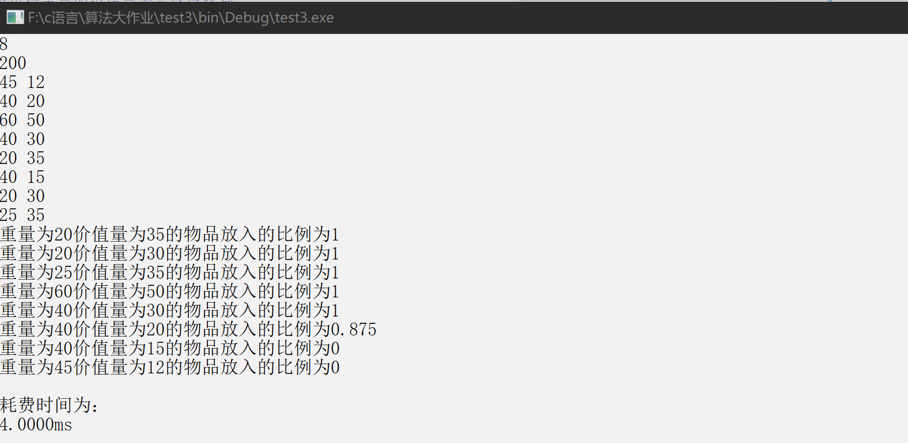
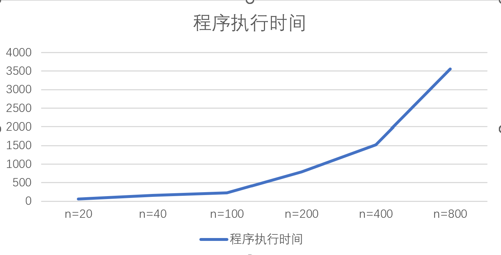

# 贪心算法实验报告

## 学号：20201060338

## 实验目的：

- 编程实现经典的贪心算法，理解贪心算法设计的基本思想、程序实现的相关技巧，加深对贪心算法设计与分析思想的理解。通过程序的执行时间测试结果，与理论上的时间复杂度结论进行对比、分析和验证。

## 实验原理

- 贪心算法的基本思想:贪心算法求解优化问题的基本思想是：采用逐步构造最优解的方法。在每个阶段，都作出一个当前最优的决策（在一定的标准下）。决策一旦作出，就不可再更改（作出贪心决策的依据称为贪心准则）。贪心算法的一般步骤如下：(1) 根据拟解决问题选取一种贪心准则；(2) 按贪心准侧标准对 n 个候选输入排序（以这一方法为代表，仍可基于堆来存储候选）；(3) 依次选择输入量加入部分解中：如果当前这个输入量的加入，不满足约束条件，则不把此输入加到这部分解中。

- 测试算法:背包问题是使用贪心算法求解的代表问题。

## 实验输入数据集

- 文本数据集：
  8
  200
  45 12
  40 20
  60 50
  40 30
  20 35
  40 15
  20 30
  25 35
- 随机数数据集：
    srand(time(0));
    for(int i=0; i<n; i++)
      a[i]=1+rand()%n;

## 实验内容

1. 用户子输入算法实现的c++版本:
       代码网址：https://github.com/naivvve/Algorithm_experiment/tree/main/work_3/beibao1.cpp
2. 随机数的算法实现的c++版本:
       代码网址：https://github.com/naivvve/Algorithm_experiment/tree/main/work_3/beibao2.cpp

## 实验结果和分析

### 1)编程实现以上 KnapsackGreedy 算法，并进行测试，保证程序正确无误。其中，分别在程序开始和结束处设置记录系统当前时间的变量、用于计算程序执行的时间（以毫秒(ms)作为时间的计数单位）。
#### 实验结果分析：
  实验结果截图如下：
  
### 2）设定一个 m 值，测试随着 n 增加、程序执行时间增加的趋势。分别使用1.1 节中的随机数生成算法生成 n 个随机数作为 n 个物品的重量，再生成 n 个随机数作为 n 个物品的价值（n=10, 20, 40, 100, 200, 400, 800, 2000）。记录随着n增加程序的执行时间，并使用 MS Excel、Matlab 或 Origin 等图表绘制工具生成程序执行时间的对比曲线图。
#### 实验结果分析：(假设m=200)
- n=10:
  算法的执行时间：5ms ;
- n=20:
  算法的执行时间：24ms ;
- n=40:
  算法的执行时间：58ms ;
- n=100:
  算法的执行时间：161ms ;
- n=200:
  算法的执行时间：224ms ;
- n=400:
  算法的执行时间：793ms ;
  n=800:
  算法的执行时间：1523ms ;
- n=2000:
  算法的执行时间：3562ms ;

- 程序执行时间的对比曲线图如下：
  
- 由以上程序执行时间对比曲线图可知：在m一定的情况下，随着n值的不断增大，算法的执行时间呈递增趋势，且增量逐渐扩大。
